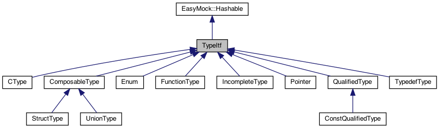

# Architecture of EasyMock

## Table of content
* [Introduction][intro]
* [Structure of the repository][sotr]
* [libEasyMockFramework.so's overall software architecture][losa]
    * [Registration of mocks to libEasyMockFramework.so][romtl]
* [EasyMockGenerate's overall software architecture][eosa]
    * [EasyMock internal objects][eio]
    * [Command line parsing][clp]
* [Architecture choices][archChoices]
    * [Memory management][memMgmt]
    * [Implementation of the copy and move constructor/operator][iotcamc]
* [Tests][tests]
    * [CType][ctype]
    * [easyMockGenerate][easyMockGenerate]
        * [Factories as test classes][fatc]
        * [Test of the parser (parser directory)][totp]
        * [Test of generated mock (generate directory)][togm]
    * [e2e][e2e]
    * [structType][structType]

## <a name="user-content-intro"></a> Introduction

The goal of this page is to give a description of the overall software
architecture, how the code is organised and also what are the concepts
that were followed when writing EasyMock.

There is also be an explanation on all the tests that have been written and
how they are organised.

This page is not going over the specific of the classes, interfaces and the
implementation since all of this information is available in the doxygen
documentation.

To generate the the doxygen documentation, you can use the following line
```sh
cd $EASYMOCK_SOURCE
doxygen docs/doxygen/Doxyfile
```
The documentation will then be available in `$EASYMOCK_SOURCE/docs/doxygen/html`

Open the file `index.html` with your favorite web browser.

## <a name="user-content-sotr"></a> Structure of the repository

```
docs ──────────────────────────────> Contains the MD documentation of the project
├── doxygen ───────────────────────> Contains the doxygen documentation of the project
src
├── common
│   └── include
├── easyMockFramework ─────────────> Contains the code to generate libEasyMockFramework.so
│   ├── include
│   └── src
├── easyMockGenerate ──────────────> Contains the code to generate EasyMockGenerate executable
│   ├── include
│   └── src
│       ├── CTemplateGenerator
│       ├── CXXOptsCmdLineParser
│       └── LLVMParser
test ──────────────────────────────> Contains the code of the unit tests
├── CType
├── easyMockGenerate
│   ├── CommandLineParser
│   ├── common
│   ├── commonClasses
│   ├── generate
│   ├── include
│   ├── includeCommonClasses
│   └── parser
├── end2end
└── StructType
```

## <a name="user-content-losa"></a>libEasyMockFramework.so's overall software architecture

libEasyMockFramework.so defines the following APIs into the following header
files:

* `easyMock.h`: Defines the API which is called by the unit tests using the
mocked header file.
* `easyMock_framework.h`: Defines the API which is called by the mocked header
code.
* `MockedFunction.h`: Defines the MockedFunction class which is a templated
class used by the mocked header code to help mocking a specific function.

Consult the Doxygen documentation for more details about those APIs. The
documentation of `easyMock.h` is also available in the main documentation
page.

### <a name="user-content-romtl"></a>Registration of mocks to libEasyMockFramework.so

When libEasyMockFramework.so is loaded, all the static object are initialised.
One of the static object is the EasyMock class. It is initialised with the
following attribute `__attribute ((init_priority(101)))`.

Afterwards, the mocks can register themselves by calling the
`easyMock_registerMockedFile` function defined in `easyMock_framework.h`. To do
that, the mock defines a static function with the following attribute
`__attribute__((constructor(102)))`.

By playing with the loading priorities, it is ensured that the EasyMock object
is properly initialised before the mocks can register themselves.

## <a name="user-content-eosa"></a> EasyMockGenerate's overall software architecture

The logic of the main code is actually very simple and written to be modular.

There are 2 modules:
- the parser: responsible of parsing the C code and to return a representation
of the functions that are parsed in a specific header file. The parsed function
are represented using the [EasyMock internal objects](#user-content-eio).
- the code generator: responsible of taking the representation given by the parser
and to generate the code that mocks the functions.

Each of those modules is instantiated and executed as needed by the main
function.

Both of the module have their own interface which means that it is easy
to replace one implementation with another if needed.
- The interface's name of the parser is `CodeParserItf`.
- The interface's name of the code generator is `CodeGeneratorItf`.

The current implementation provides an implementation for the parser and
the code generator:
- the implementation of the parser is based on LLVM.
- the implementation of the code generate uses Google ctemplate.

If for any reason, there might be a need to change the parser implementation
using another library, the work to be done is just to implement a new parser
by inheriting `CodeParserItf` and to modify the main code to give the choice to
the user to choose in between both of implementation.

The representation of the parsed function is done via the
[EasyMock internal objects](#user-content-eio).

### <a name="user-content-eio"></a> EasyMock internal objects

Here is the class diagram of the EasyMock internal objects.



It gives all what all the necessaries to represent any C function and any C type.

For complete information about each of the classes consult the doxygen documentation.

Beside those object, there is also another class tree to represent the concept
of `structure's field`, `parameter` and `return value`. This can be seen from
the following class diagram.


Again, a complete explanation of those classes is available in the doxygen documentation.

[All the care has been taken][iotcamc] to make sure that all the internal
objects of Easymock are copyable and moveable.

### <a name="user-content-clp"></a> Command line parsing
The command line parsing functionality is done with the help of
[ccxopts](https://github.com/jarro2783/cxxopts).

This library is abstracted by the CommandLineParserItf interface. It is defined
in `$EASYMOCK_SOURCE/src/EasyMockGenerate/include/CommandLineParserItf.h`

This means that the command line parsing can be replaced easily if the need arises.

## <a name="user-content-arch-choices"></a> Architecture choices
Personal note from the author:
```
This project was the opportunity to improve my C++ skills. One part that I
wanted to experience was the implementation and maintenance of copy/move
constructor/operator.

As such, I decided not to use smart pointer. This is obviously arguable but
that's the choice I've made and I'm pretty happy with how the code turned out
to implemented though I recognise that my implementation is probably not the
best regarding the memory usage since deep copies of objects are made.
```

An important concept explained in the next section is the concept of
`ownership of pointer`.

### <a name="user-content-memory-management">Memory management
Since the choice was made not to use smart pointers, the obvious question is how
to cleanup the dynamically allocated objects without creating a memory leak
when a class as a pointer to another class. The solution to this is that each
class is responsible to free it's own data member when they are pointers.
Unless stated otherwise in the doxygen documentation, each pointer given to
a constructor or method of any [EasyMock internal objects][eio] must be
allocated on the heap and cannot be used by the calling function after
that pointer was passed. This is called passing the
**ownership of the pointer**.

For instance, whenever a function allocates a CType object with the new
operator, it gets the ownership of that pointer. Afterwards, whenever the
function gives this pointer to a ReturnValue object, it looses the ownership
of the pointer. This means:
1. The ReturnValue object is the owner of the pointer. I.e it must clean the
pointer in its destructor.
2. The calling function is not responsible to free that pointer anymore.
3. The calling function is not allowed to access or modify the value pointed
by this pointer.

The best practice is to nullify the pointer just after loosing the ownership
to avoid tricky behaviour.

### <a name="iotcamc"></a> Implementation of the copy and move constructor/operator

For objects containing pointer members, the copy and move constructor/operator
are implemented by using the "copy and swap idiom". This make sure to minimise
the overhead of copying and moving the objects by only passing the pointer
from one object to another and not the full object.

Good references to understand the "copy and swap idiom" are:
- [This stackoverflow post](https://stackoverflow.com/questions/3279543/what-is-the-copy-and-swap-idiom)
- [cppreference](https://en.cppreference.com/w/cpp/language/operators#Assignment_operator)

## <a name="user-content-tests"></a> Tests

EasyMock is thoroughly tested. The test framework chosen is GoogleTests.
In order to run the tests, the command `make check` can be used.

The rest of this section goes through the different unit tests that are
implemented.

### <a name="user-content-ctype"></a> CType
Validates the specific interface re-implementation of the CType class.

### <a name="user-content-easyMockGenerate"></a> easyMockGenerate
This folders contains all the logic to validate EasyMockGenerate.
libEasyMockFramework.so is also validated here because the generated mocks
uses libEasyMockFramework.so.

The sub-directories are organised as followed:
* CommandLineParser: Contains the code which test the command line parser of
EasyMockGenerate.
* common: Contains the UT which tests the copyability and moveability of all
the [EasyMock internal objects][eio].
* commonClasses: Implementation of all the function factories test code.
* generate: Contains the tests that verifies that the generated mocks compiles
and works as expected.
* include: Contains the header file that are mocked by the tests.
* includeCommonClasses: Contains the definition of the function factories
test code.
* parser: Contains the test which verifies the parser functionalities.

The tests present in this folder are divided in 2 categories
1. [Test the parser][totp]
2. [Test of generated mocks][togm]

#### <a name="user-content-fatc"></a>Factories as test classes
To help testing the parsing of the header file and the generation of the mocks,
factories are implemented. One factory represents a specific C function to be
mocked/tested. This gives the flexibility for adding new function to the tests
easily. If a new function (e.g. taking a specific new specific struct
as parameter) needs to be tested, it is only required to implement the factory,
register it into the list and all the already implemented tests will run
against it automatically. The factory actually represents a `"test class"`
and is implemented using Google's templated test case. The interface of the
factory defined in FunctionFactory.h is described into the doxygen documentation.

#### <a name="user-content-totp"></a> Test of the parser (parser directory)
Each of the test class which verify the generated mocks perform the following
actions:
1. Gets the path to the header file to be parsed from the factory.
2. Calls the API that parses the the header file.
3. Verifies that the set of [EasyMock internal object][eio] returned by the
parser is as expected.

#### <a name="user-content-togm"></a> Test of generated mocks (generate directory)
Each of the test class which verify the generated mocks perform the following
actions:
1. Receives a hardcoded set of [EasyMock internal object][eio] from the factory.
2. Calls the API to generate the mocks.
3. Compiles a .so containing the results of the compilation of the file created
in step 2. This step actually tests that the generated code can be compiled
properly.
4. Load the .so
5. Calls the mocks. This step is different in each test case within the test
class and validate that the generate code can be executed without any error.
6. Verifies the status of EasyMock. I.E Checks whether an error has occured
when it should, etc...

The very generic tests classes are implemented inside `test_genGenerate.cpp`,
`test_compileOnly.cpp` and `test_genGenerateOutputPtr`. Other more specific
tests classes are implemented in the same directory. The only difference is
that they will target a specific factory instead of being able of executing
their test cases against a list of factories.

### <a name="user-content-end2end"></a> end2end

This folder contains tests to validate that the EasyMockGenerate binary is
working properly. Rather than separating the call of the parser and the call
of the generator in 2 different tests (like in the
[easyMockGenerate directory][easyMockGenerate], those tests call directly the
EasyMockGenerate binary to validate that the end user experience is working
as it is expected. Eventually, some small test cases using the generated
mocks (as the user would write them) are run.

### <a name="user-content-structType"></a> StructType
Validates the specific interface re-implementation of the StructType class.

[intro]: #user-content-intro
[sotr]: #user-content-sotr
[losa]: #user-content-losa
[romtl]: #user-content-romtl
[eosa]: #user-content-eosa
[eio]: #user-content-eio
[clp]: #user-content-clp
[archChoices]: #user-content-arch-choices
[memMgmt]: #user-content-memory-management
[iotcamc]: #user-content-iotcamc
[tests]: #user-content-tests
[ctype]: #user-content-ctype
[easyMockGenerate]: #user-content-easyMockGenerate
[fatc]: #user-content-fatc
[totp]: #user-content-totp
[togm]: #user-content-togm
[e2e]: #user-content-end2end
[structType]: #user-content-structType
